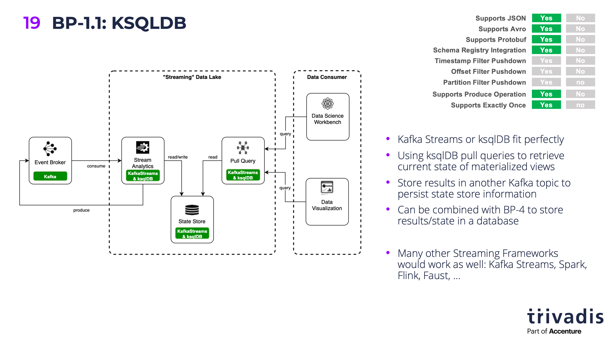

# Kafka as your Data Lake - is it feasible?

## Demo 1 - Streaming Data Lake

This demo will show how stream processing can be used to transform raw data (events) into usage-optimised data, ready to be consumed. We will use [ksqlDB](http://ksqldb.io) as the stream processing framework, but any other would work as well.



### Connect to ksqlDB engine

Let's connect to the ksqlDB shell

```
docker exec -it ksqldb-cli ksql http://ksqldb-server-1:8088
```

#### Create Stream and SELECT from it

First drop the stream if it already exists:

```
DROP STREAM IF EXISTS truck_position_raw_s;
```

Now let's create the ksqlDB Stream

```
CREATE STREAM IF NOT EXISTS truck_position_raw_s 
  (timestamp VARCHAR, 
   truckId VARCHAR, 
   driverId BIGINT, 
   routeId BIGINT,
   eventType VARCHAR,
   latitude DOUBLE,
   longitude DOUBLE,
   correlationId VARCHAR)
  WITH (kafka_topic='truck_position',
        value_format='JSON');
```

Let's see the live data by using a `SELECT` on the Stream with the `EMIT CHANGES` clause:

```
SELECT * FROM truck_position_raw_s 
EMIT CHANGES;
```

#### Create a new "refined" stream where the data is transformed into Avro

First drop the stream if it already exists:

```
DROP STREAM IF EXISTS truck_position_refined_s;
```

And now crate the refined ksqlDB Stream:

```
CREATE STREAM IF NOT EXISTS truck_position_refined_s 
  WITH (kafka_topic='truck_position_refined',
        value_format='AVRO')
AS SELECT *
FROM truck_position_raw_s
EMIT CHANGES;
```

to check that the refined topic does in fact hold avro formatted data, let's just do a normal kafkacat on the `truck_position_refined` topic

```
docker exec -ti kafkacat kafkacat -b kafka-1 -t truck_position_refined
```

we can see that it is avro 

```
                            Normal���Q�B@ףp=
WX�$343671958179690963
1598125263176886����
                             Normal��Q��C@�p=
דW�$343671958179690963
% Reached end of topic truck_position_refined [0] at offset 367
159812526333671�ߩ�2Unsafe following distance�Q���B@���(\?W�$343671958179690963
% Reached end of topic truck_position_refined [5] at offset 353
% Reached end of topic truck_position_refined [2] at offset 324
1598125263526101����
                              Normal=
ףpE@R����V�$343671958179690963
% Reached end of topic truck_position_refined [7] at offset 355
```

we can use the `-s` and `-r` option to specify the Avro Serde and the URL of the schema registry

```
docker exec -ti kafkacat kafkacat -b kafka-1 -t truck_position_refined -s avro -r http://schema-registry-1:8081
```

#### Create a new "usage-optimized" stream with the data filered

In this new stream we are only interested in the messages where the `eventType` is not normal. First let's create a SELECT statement which performs the right result, using the ksqlDB CLI:

```
SELECT * FROM truck_position_refined_s 
WHERE eventType != 'Normal'
EMIT CHANGES;
```

Now let's create a new stream with that information. 

```
DROP STREAM IF EXISTS problematic_driving_s;

CREATE STREAM IF NOT EXISTS problematic_driving_s \
  WITH (kafka_topic='problematic_driving', \
        value_format='AVRO', \
        partitions=8) \
AS 
SELECT * 
FROM truck_position_refined_s \
WHERE eventtype != 'Normal';
```

We can see that the stream now only contains the messages filtered down to the relevant ones:

```
SELECT * FROM problematic_driving_s
EMIT CHANGES;
```

We can also see the same information by directly getting the data from the underlaying kafka topic `problematic_driving`:

```
docker exec -ti kafkacat kafkacat -b kafka-1 -t problematic_driving -s avro -r http://schema-registry-1:8081
```
