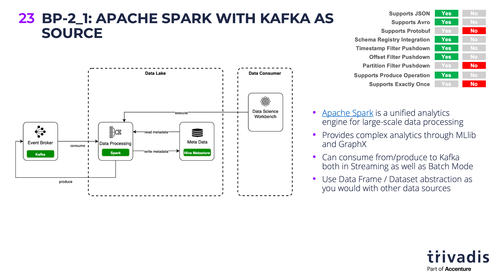

# Kafka as your Data Lake - is it feasible?

## Demo 2 - Batch Processing with Spark

In this demo we will see how Spark can be used to access the [Kafka topic from a Batch process](https://spark.apache.org/docs/latest/structured-streaming-kafka-integration.html). In this demo we are using the Spark Python API, it could easily be done in Scala or Java as well. 



You can import the Zeppelin notebook with all the code using this link: `https://raw.githubusercontent.com/gschmutz/kafka-as-your-datalake-demo/master/zeppelin/Spark%20Batch%20%26%20Apache%20Kafka.json`.

Alternatively, you can also use the `pyspark` to execute the statements.

``` bash
docker exec -it spark-master pyspark --packages org.apache.spark:spark-sql-kafka-0-10_2.12:3.1.3
```

Subscribe to Kafka Topic `truck_position` and load it as a data frame:

``` python
rawDf = spark.read.format("kafka").option("kafka.bootstrap.servers", "kafka-1:19092,kafka-2:19093").option("subscribe", "truck_position").load()
```

Print Schema of data frame

``` python
rawDf.printSchema
```

we can see that the value is shown as a binary column:

``` bash
<bound method DataFrame.printSchema of DataFrame[key: binary, value: binary, topic: string, partition: int, offset: bigint, timestamp: timestamp, timestampType: int]>
```

To interpret it as JSON (the data in `truck_position` is a JSON formatted message) a custom schema is necessary:

``` python
from pyspark.sql.types import *

truckPositionSchema = StructType().add("timestamp", TimestampType()).add("truckId",LongType()).add("driverId", LongType()).add("routeId", LongType()).add("eventType", StringType()).add("latitude", DoubleType()).add("longitude", DoubleType()).add("correlationId", StringType()) 
```

Convert the JSON message into new data frame using schema defined before

``` python
from pyspark.sql.functions import from_json

jsonDf = rawDf.selectExpr("CAST(value AS string)")
jsonDf = jsonDf.select(from_json(jsonDf.value, truckPositionSchema).alias("json")).selectExpr("json.*", "cast(cast (json.timestamp as double) / 1000 as timestamp) as eventTime")
```

Print schema of new data frame

``` python
jsonDf.printSchema
```

and we can now see that the data frame "knows" about the different values in the message, such as `eventType`, `latitude` and `longitude`:

``` bash
<bound method DataFrame.printSchema of DataFrame[timestamp: timestamp, truckId: bigint, driverId: bigint, routeId: bigint, eventType: string, latitude: double, longitude: double, correlationId: string, eventTime: timestamp]>
```

Let's see what the Data Frame contains using the `show` function

``` python
jsonDf.show(10)
```

and we can see that the Data Frame  

```
+--------------------+-------+--------+----------+---------+--------+---------+--------------------+--------------------+
|           timestamp|truckId|driverId|   routeId|eventType|latitude|longitude|       correlationId|           eventTime|
+--------------------+-------+--------+----------+---------+--------+---------+--------------------+--------------------+
|52601-05-01 03:08...|     81|      13|1927624662|   Normal|   41.62|   -93.58|-2599424926733256171|2020-08-18 17:06:...|
|52601-05-01 03:19...|     75|      16|1390372503|   Normal|    40.7|   -89.52|-2599424926733256171|2020-08-18 17:06:...|
|52601-05-01 03:20...|     57|      24|1594289134|   Normal|   38.65|    -90.2|-2599424926733256171|2020-08-18 17:06:...|
|52601-05-01 04:04...|     75|      16|1390372503|   Normal|   40.86|   -89.91|-2599424926733256171|2020-08-18 17:06:...|
|52601-05-01 04:04...|     81|      13|1927624662|   Normal|   41.69|   -93.36|-2599424926733256171|2020-08-18 17:06:...|
|52601-05-01 04:15...|     57|      24|1594289134|   Normal|    39.1|   -89.74|-2599424926733256171|2020-08-18 17:06:...|
|52601-05-01 05:02...|     75|      16|1390372503|   Normal|   40.96|   -90.29|-2599424926733256171|2020-08-18 17:07:...|
|52601-05-01 05:08...|     81|      13|1927624662|   Normal|   41.71|   -93.04|-2599424926733256171|2020-08-18 17:07:...|
|52601-05-01 05:13...|     57|      24|1594289134|   Normal|   39.84|   -89.63|-2599424926733256171|2020-08-18 17:07:...|
|52601-05-01 06:00...|     75|      16|1390372503|   Normal|   41.54|   -90.44|-2599424926733256171|2020-08-18 17:07:...|
+--------------------+-------+--------+----------+---------+--------+---------+--------------------+--------------------+
only showing top 10 rows
```

Register the Data Frame as temporary table so it can be used with Spark SQL

``` python
jsonDf.createOrReplaceTempView("truck_position")
```

Use the SQL directive to work on the temporary table and show the number of rows in the table (i.e. number of messages in the Kafka topic) - the %SQL directive only works in Zeppelin, in `pyspark` you can use the `spark.sql()` function to execute the SQL statements, shown below.

``` sql
%sql
SELECT count(*) FROM truck_position
```

Now let's see all rows where the event type is not `Normal`. Knowing SQL, such a query is easy to write:

``` sql
%sql
SELECT * FROM truck_position WHERE eventType != 'Normal'
```

In `pyspark`, it not using Zeppelin notebook, that query can be executed and the result shown using the following statement:

``` python
spark.sql ("SELECT * FROM truck_position WHERE eventType != 'Normal'").show()
```

and you will get a result similar to the one shown below:

```
+--------------------+-------+--------+----------+--------------------+--------+---------+--------------------+--------------------+
|           timestamp|truckId|driverId|   routeId|           eventType|latitude|longitude|       correlationId|           eventTime|
+--------------------+-------+--------+----------+--------------------+--------+---------+--------------------+--------------------+
|52601-05-05 18:30...|     84|      14|1565885487|Unsafe following ...|   34.78|   -92.31|-3346512142276945740|2020-08-18 17:13:...|
|52601-05-05 19:21...|     78|      24| 987179512|           Overspeed|    40.7|   -89.52|-3346512142276945740|2020-08-18 17:13:...|
|52601-05-05 19:24...|     59|      19|1594289134|Unsafe tail distance|   35.37|   -94.57|-3346512142276945740|2020-08-18 17:13:...|
|52601-05-09 19:58...|     78|      24| 987179512|Unsafe following ...|   37.47|   -89.71|-3346512142276945740|2020-08-18 17:19:...|
|52601-05-09 20:16...|     84|      14|1565885487|Unsafe following ...|   41.48|   -88.07|-3346512142276945740|2020-08-18 17:19:...|
|52601-05-09 22:15...|     59|      19|1594289134|Unsafe tail distance|   35.47|   -94.88|-3346512142276945740|2020-08-18 17:19:...|
|52612-07-26 00:32...|     78|      31|1565885487|Unsafe tail distance|   38.04|   -91.55|  343671958179690963|2020-08-22 19:36:...|
|52612-07-30 01:02...|     78|      31|1565885487|           Overspeed|   37.08|   -93.96|  343671958179690963|2020-08-22 19:42:...|
|52612-08-07 07:37...|     84|      13| 371182829|           Overspeed|   41.92|   -89.03| -787237122393257022|2020-08-22 19:54:...|
|52612-08-07 09:13...|     57|      22|1567254452|           Overspeed|   35.19|   -90.04| -787237122393257022|2020-08-22 19:54:...|
|52612-08-15 06:22...|     84|      13| 371182829|Unsafe tail distance|   41.56|   -90.64| -787237122393257022|2020-08-22 20:05:...|
|52612-08-15 11:13...|     57|      22|1567254452|      Lane Departure|   34.78|   -92.31| -787237122393257022|2020-08-22 20:05:...|
|52612-08-19 07:47...|     84|      13| 371182829|Unsafe tail distance|   39.77|   -94.15| -787237122393257022|2020-08-22 20:11:...|
|52612-08-19 12:18...|     57|      22|1567254452|Unsafe following ...|   42.23|   -91.78| -787237122393257022|2020-08-22 20:11:...|
|52612-08-27 21:28...|     57|      26|1325712174|      Lane Departure|   36.17|   -95.99| 1625237001447494889|2020-08-22 20:23:...|
|52612-08-27 21:43...|     73|      31|1390372503|           Overspeed|   35.68|   -90.07| 1625237001447494889|2020-08-22 20:23:...|
|52612-08-27 22:25...|     24|      22|1961634315|      Lane Departure|   35.19|   -90.04| 1625237001447494889|2020-08-22 20:23:...|
|52612-09-03 09:49...|     73|      27| 160405074|           Overspeed|   38.83|   -90.79| 3510602943545029740|2020-08-22 20:33:...|
|52612-09-03 10:29...|     78|      16|  24929475|Unsafe following ...|    40.7|   -89.52| 3510602943545029740|2020-08-22 20:33:...|
|52612-09-03 10:40...|     75|      24|1565885487|Unsafe tail distance|   35.47|   -94.88| 3510602943545029740|2020-08-22 20:33:...|
+--------------------+-------+--------+----------+--------------------+--------+---------+--------------------+--------------------+
only showing top 20 rows
```
****