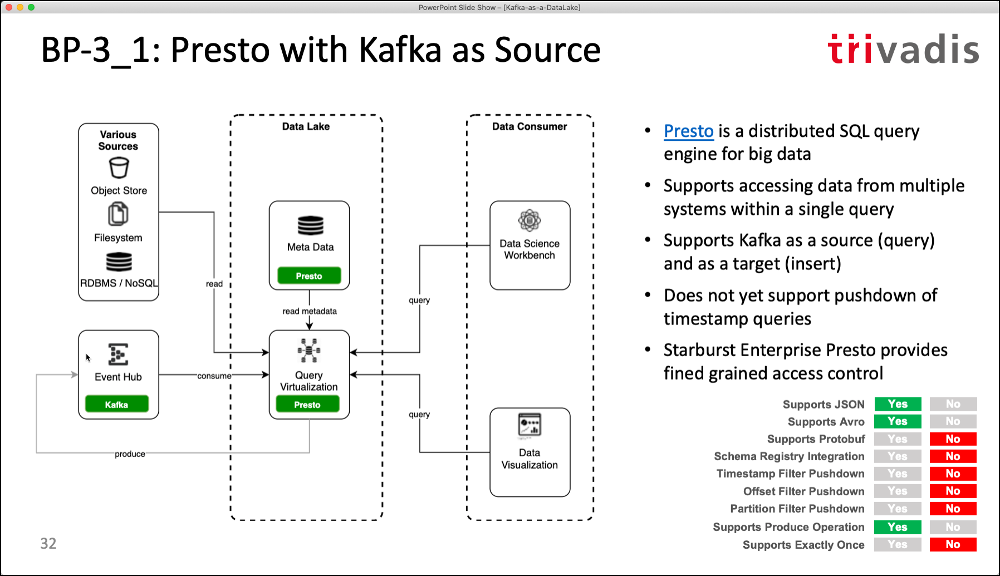

# Kafka as your Data Lake - is it feasible?

## Demo 3 - Batch Query with Presto

In this demo we will show how Presto can be used to query a Kafka topic in a "batch" manner. With that you basically treat Kafka as a "table" and can perform queries on all the data stored in the topic. 



Currently the Presto Kafka connector does not support filter pushdowns, but there is an [active pull request #4805](https://github.com/prestosql/presto/pull/4805) implementing that. 

Since the recording of the session, support for Apache Avro has been added, but not yet with Schema Registry support, but there is another [active pull request #4805](https://github.com/prestosql/presto/pull/2499) which will add that.

### Configure the Kafka connector

First lets configure the [Kafka connector](https://prestodb.io/docs/current/connector/kafka.html) and make the Kafka topics known to Kafka.

In order to not change the `docker-compose.yml` (it is generated) directly, we can use the `cdocker-compose.override.yml` file to overwrite settings of the various services. 

Add the following lines to `docker-compose.override.yml`:

``` yaml
version: '3.0'
services:
  presto-1:
    volumes:
      - ./conf/presto/catalog/kafka.properties:/usr/lib/presto/etc/catalog/kafka.properties
      - ./conf/presto/catlog/kafka-hive.properties:/usr/lib/presto/etc/catalog/kafka-hive.properties
      - ./scripts/presto/truck_position.json:/usr/lib/presto/default/etc/kafka/truck_position.json
      - ./plugins/presto/presto-kafka-340.jar:/usr/lib/presto/plugin/kafka/presto-kafka-340.jar
```

if using Presto DB, it would be

``` yaml
version: '3.0'
services:
  presto-1:
    volumes:
      - ./conf/presto/kafka.properties:/opt/presto-server/etc/catalog/kafka.properties
      - ./conf/presto/kafka-hive.properties:/opt/presto-server/etc/catalog/kafka-hive.properties
      - ./scripts/presto/truck_position.json:/opt/presto-server/etc/kafka/tabledesc/truck_position.json
```

Create the `kafka.properties` in folder `./conf/presto/catalog`. We can see that we register `truck_position` as a table and assign it to the `logistics` schema. 

``` properties
kafka.nodes=kafka-1:19092
kafka.table-names=truck_position
kafka.default-schema=logistics
kafka.hide-internal-columns=false
kafka.table-description-dir=/usr/lib/presto/default/etc/kafka
```

Restart the `presto-1` service so that the configuration changes are picked up by Presto.

``` bash
docker restart presto-1
```

### Let's use Presto to query the data from the Kafka topic

Next let's query the data from Presto. Connect to the Presto CLI using

``` bash
docker exec -ti presto-cli presto --server presto-1:8080 --catalog kafka --schema logistics
```

on the `presto:logistics>` prompt use the `show tables` command to display the registered tables:

``` sql
show tables;
```

and you should get exactly one row back, the `truck_position` table:

```
presto:logistics> show tables
               -> ;
     Table      
----------------
 truck_position 
(1 row)
```

Now we can use the `SELECT` statement on the table to return the data:

``` sql
SELECT * FROM truck_position;
```

We can see that we get some data back, but the message is shown as just one column `_message`, and not split up into one column per field in the message. The reason for that is that the connector does not yet know about how to interpret the message.  

```
presto:logistics> SELECT * FROM truck_position;
 _partition_id | _partition_offset | _message_corrupt |                                                                                            _message
---------------+-------------------+------------------+---------------------------------------------------------------------------------------------------------------------------------------------
             2 |                 0 | false            | {"timestamp":1597770414534,"truckId":58,"driverId":32,"routeId":1325712174,"eventType":"Normal","correlationId":"-2599424926733256171","lati
             2 |                 1 | false            | {"timestamp":1597770417571,"truckId":58,"driverId":32,"routeId":1325712174,"eventType":"Normal","correlationId":"-2599424926733256171","lati
             2 |                 2 | false            | {"timestamp":1597770420720,"truckId":58,"driverId":32,"routeId":1325712174,"eventType":"Normal","correlationId":"-2599424926733256171","lati
             2 |                 3 | false            | {"timestamp":1597770424360,"truckId":58,"driverId":32,"routeId":1325712174,"eventType":"Normal","correlationId":"-2599424926733256171","lati
             2 |                 4 | false            | {"timestamp":1597770427381,"truckId":58,"driverId":32,"routeId":1325712174,"eventType":"Normal","correlationId":"-2599424926733256171","lati
             2 |                 5 | false            | {"timestamp":1597770430941,"truckId":58,"driverId":32,"routeId":1325712174,"eventType":"Normal","correlationId":"-2599424926733256171","lati
             2 |                 6 | false            | {"timestamp":1597770434240,"truckId":58,"driverId":32,"routeId":1325712174,"eventType":"Normal","correlationId":"-2599424926733256171","lati
             2 |                 7 | false            | {"timestamp":1597770437801,"truckId":58,"driverId":32,"routeId":1325712174,"eventType":"Normal","correlationId":"-2599424926733256171","lati
             2 |                 8 | false            | {"timestamp":1597770440870,"truckId":58,"driverId":32,"routeId":1325712174,"eventType":"Normal","correlationId":"-2599424926733256171","lati
             2 |                 9 | false            | {"timestamp":1597770444700,"truckId":58,"driverId":32,"routeId":1325712174,"eventType":"Normal","correlationId":"-2599424926733256171","lati
             2 |                10 | false            | {"timestamp":1597770448101,"truckId":58,"driverId":32,"routeId":1325712174,"eventType":"Normal","correlationId":"-2599424926733256171","lati
```

One way to split the value of the `_message` column up is by using the `json_extract` Presto SQL function:

``` sql
SELECT json_extract(_message, '$.truckId') as truck_id
	, json_extract(_message, '$.driverId') as driver_id
	, json_extract(_message, '$.eventType') as event_type 
	, json_extract(_message, '$.latitude') as latitude 
	, json_extract(_message, '$.longitude') as longitude 
FROM truck_position;
```

Unfortunately the Presto Kafka connector does not support creating views, so every access of the table would have to deal with this. 

But there is another way to do the mapping in a more static fashion. 


### Using a table definition to map the topic to a table

We can create a table definition file, which consists of a JSON definition for a table. Create a file `truck_position.json` in the folder `./scripts/presto/` and add the following content:

``` json
{
    "tableName": "truck_position",
    "schemaName": "logistics",
    "topicName": "truck_position",
    "key": {
        "dataFormat": "raw",
        "fields": [
            {
                "name": "kafka_key",
                "dataFormat": "BYTE",
                "type": "VARCHAR",
                "hidden": "false"
            }        
	]
    },
    "message": {
        "dataFormat": "json",
        "fields": [
            {
                "name": "timestamp",
                "mapping": "timestamp",
                "type": "BIGINT",
                "comment": "Time of the tracking message in real life"
            },
            {
                "name": "truck_id",
                "mapping": "truckId",
                "type": "BIGINT",
                "comment": "ID of the truck"
            },
            {
                "name": "driver_id",
                "mapping": "driverId",
                "type": "BIGINT",
                "comment": "ID of the driver"
            },
            {
                "name": "route_id",
                "mapping": "routeId",
                "type": "BIGINT",
                "comment": "ID of the route the truck is driving on."
            },
            {
                "name": "event_type",
                "mapping": "eventType",
                "type": "VARCHAR",
                "comment": "Driving behaviour, where Normal signals normal behaviour"
            },
            {
                "name": "latitude",
                "mapping": "latitude",
                "type": "DOUBLE",
                "comment": "Latitude part of the geo coordinate"
            },
            {
                "name": "longitude",
                "mapping": "longitude",
                "type": "DOUBLE",
                "comment": "Longitude part of the geo coordinate"
            }       
	]
    }
}
```

In the `kafka.properties` configuration file, there is one setting `kafka.table-description-dir=/usr/lib/presto/default/etc/kafka` which specifies where Presto can find the table definition file and in the `docker-compose.override.yml` the local file defined above is mapped into the `presto-1` container.

Recreate the `presto-1` container using `docker-compose up -d`.

Now we can use the `SELECT` statement to prove that the mapping is working. From the Presto command line, execute:

``` sql
SELECT * FROM truck_position;
```

we can see that there is no longer a `_message` column but instead one column for each mapping of the table definition file. Much more usable of course!

```
presto:logistics> SELECT * FROM truck_position;
 kafka_key |   timestamp   | truck_id | driver_id |  route_id  |        event_type         | latitude | longitude | _partition_id | _partition_offset | _message_corrupt |
-----------+---------------+----------+-----------+------------+---------------------------+----------+-----------+---------------+-------------------+------------------+--------------------------
 81        | 1597770414480 |       81 |      NULL | 1927624662 | Normal                    |    41.62 |    -93.58 |             1 |                 0 | false            | {"timestamp":159777041448
 75        | 1597770415144 |       75 |      NULL | 1390372503 | Normal                    |     40.7 |    -89.52 |             1 |                 1 | false            | {"timestamp":159777041514
 57        | 1597770415211 |       57 |      NULL | 1594289134 | Normal                    |    38.65 |     -90.2 |             1 |                 2 | false            | {"timestamp":159777041521
 75        | 1597770417850 |       75 |      NULL | 1390372503 | Normal                    |    40.86 |    -89.91 |             1 |                 3 | false            | {"timestamp":159777041785
 81        | 1597770417865 |       81 |      NULL | 1927624662 | Normal                    |    41.69 |    -93.36 |             1 |                 4 | false            | {"timestamp":159777041786
 57        | 1597770418510 |       57 |      NULL | 1594289134 | Normal                    |     39.1 |    -89.74 |             1 |                 5 | false            | {"timestamp":159777041851
 75        | 1597770421350 |       75 |      NULL | 1390372503 | Normal                    |    40.96 |    -90.29 |             1 |                 6 | false            | {"timestamp":159777042135
 81        | 1597770421700 |       81 |      NULL | 1927624662 | Normal                    |    41.71 |    -93.04 |             1 |                 7 | false            | {"timestamp":159777042170
 57        | 1597770422001 |       57 |      NULL | 1594289134 | Normal                    |    39.84 |    -89.63 |             1 |                 8 | false            | {"timestamp":159777042200
``` 

We can also do a describe of the table to see the definition

``` sql
DESCRIBE truck_position;
```

We can see "our" own columns from the definition and some other internal columns all starting with `_`. They represent some technical properties of a Kafka message, such as the partition or the offset of the message.

```
presto:logistics> describe truck_position;
      Column       |     Type     | Extra |                         Comment
-------------------+--------------+-------+----------------------------------------------------------
 kafka_key         | varchar      |       |
 timestamp         | bigint       |       | Time of the tracking message in real life
 truck_id          | bigint       |       | ID of the truck
 driver_id         | bigint       |       | ID of the driver
 route_id          | bigint       |       | ID of the route the truck is driving on.
 event_type        | varchar      |       | Driving behaviour, where Normal signals normal behaviour
 latitude          | double       |       | Latitude part of the geo coordinate
 longitude         | double       |       | Longitude part of the geo coordinate
 _partition_id     | bigint       |       | Partition Id
 _partition_offset | bigint       |       | Offset for the message within the partition
 _message_corrupt  | boolean      |       | Message data is corrupt
 _message          | varchar      |       | Message text
 _message_length   | bigint       |       | Total number of message bytes
 _key_corrupt      | boolean      |       | Key data is corrupt
 _key              | varchar      |       | Key text
 _key_length       | bigint       |       | Total number of key bytes
 _timestamp        | timestamp(3) |       | Offset Timestamp
(17 rows)
```

We can restrict on any column, for example on `event_type`.

``` sql
SELECT * FROM truck_position
WHERE event_type != 'Normal';
```

It will of course do a full topic scan, as there are no indexes on Kafka (except on timestamp to offset):

```
 kafka_key |   timestamp   | truck_id | driver_id |  route_id  |        event_type         | latitude | longitude | _partition_id | _partition_offset | _message_corrupt |
-----------+---------------+----------+-----------+------------+---------------------------+----------+-----------+---------------+-------------------+------------------+--------------------------
 28        | 1597770574886 |       28 |        10 | 1962261785 | Overspeed                 |    36.37 |     -95.5 |             3 |                29 | false            | {"timestamp":159777057488
 28        | 1597770676875 |       28 |        10 | 1962261785 | Unsafe following distance |    38.22 |    -91.18 |             3 |                59 | false            | {"timestamp":159777067687
 28        | 1597770782107 |       28 |        10 | 1962261785 | Unsafe tail distance      |    37.09 |    -94.23 |             3 |                89 | false            | {"timestamp":159777078210
 28        | 1597770887296 |       28 |        10 | 1962261785 | Overspeed                 |    37.81 |    -92.08 |             3 |               119 | false            | {"timestamp":159777088729
 28        | 1597770993075 |       28 |        10 | 1962261785 | Lane Departure            |    37.51 |    -92.89 |             3 |               149 | false            | {"timestamp":159777099307
 28        | 1597771098076 |       28 |        10 | 1962261785 | Lane Departure            |    37.34 |    -92.99 |             3 |               179 | false            | {"timestamp":159777109807
 28        | 1597771206866 |       28 |        10 | 1962261785 | Overspeed                 |    37.94 |    -91.99 |             3 |               209 | false            | {"timestamp":159777120686
 28        | 1597771310386 |       28 |        10 | 1962261785 | Unsafe following distance |    37.02 |    -94.54 |             3 |               239 | false            | {"timestamp":159777131038
 71        | 1598124739056 |       71 |        10 | 1927624662 | Unsafe tail distance      |    36.37 |     -95.5 |             3 |               412 | false            | {"timestamp":159812473905
 71        | 1598124841586 |       71 |        10 | 1927624662 | Unsafe following distance |    38.22 |    -91.18 |             3 |               559 | false            | {"timestamp":159812484158
 71        | 1598124944886 |       71 |        10 | 1927624662 | Unsafe following distance |    37.09 |    -94.23 |             3 |               708 | false            | {"timestamp":159812494488
 31        | 1598124950196 |       31 |        25 | 1961634315 | Unsafe tail distance      |    36.84 |    -89.54 |             3 |               715 | false            | {"timestamp":159812495019
 88        | 1598124985256 |       88 |        27 |  160779139 | Unsafe tail distance      |    38.83 |    -90.79 |             3 |               765 | false            | {"timestamp":159812498525
 92        | 1598124986356 |       92 |        16 |  987179512 | Unsafe tail distance      |     40.7 |    -89.52 |             3 |               766 | false            | {"timestamp":159812498635
```
 
Knowing that we can also do more complex analytics using all the capabilities of the SQL language built into Presto and available to the Kafka connector as well. 

``` sql
SELECT driver_id, event_type, count(*) as nof
FROM truck_position
WHERE event_type != 'Normal'
GROUP BY driver_id, event_type;
```

We get the count of unnormal event types per driver:

```
 driver_id |        event_type         | nof
-----------+---------------------------+-----
        11 | Overspeed                 |  71
        11 | Lane Departure            |  74
        15 | Lane Departure            |  10
        32 | Overspeed                 |   6
        25 | Lane Departure            |   8
        22 | Overspeed                 |   7
        18 | Unsafe tail distance      |  12
        16 | Unsafe tail distance      |   7
        20 | Lane Departure            |   5
        27 | Overspeed                 |   4
        30 | Overspeed                 |   8
        28 | Overspeed                 |   8
        29 | Unsafe tail distance      |   3
        29 | Lane Departure            |   5
        18 | Overspeed                 |   4
        20 | Unsafe tail distance      |  11
        20 | Overspeed                 |   8
        16 | Lane Departure            |   5
        32 | Lane Departure            |  10
        28 | Unsafe following distance |   6
        28 | Unsafe tail distance      |   8
        27 | Unsafe following distance |  10
        17 | Unsafe tail distance      |   5
        17 | Lane Departure            |   8
        18 | Unsafe following distance |   5
```

In such a query it would be interesting to know the name of the driver. But this information it is not available in the Kafka topic. Knowing SQL, we could use a Join Operation to join data from the `truck_position` table/topic to the `driver` table in the Postgresql database (we have created in the preperation step above). This is what we will do in the next section.

### Joining with Driver table in Postgresql

Presto allows to work with multiple data sources in one single statement. Let's again connect with the Presto CLI to `presto-1`

``` bash
docker exec -ti presto-cli presto --server presto-1:8080 --catalog kafka --schema logistics
```

and use the following SQL statement to access the `driver` table in the `logistics_db` schema over the Presto `postgresql` connector.

``` sql
SELECT * FROM postgresql.logistics_db.driver;
```

we can see the data retrieved from the Postgresql table:

```
 id | first_name | last_name  | available | birthdate  |       last_update
----+------------+------------+-----------+------------+-------------------------
 10 | Diann      | Butler     | Y         | 2068-06-10 | 2020-08-23 11:30:36.936
 11 | Micky      | Isaacson   | Y         | 1972-08-31 | 2020-08-23 11:30:36.940
 12 | Laurence   | Lindsey    | Y         | 1978-05-19 | 2020-08-23 11:30:36.942
 13 | Pam        | Harrington | Y         | 2068-06-10 | 2020-08-23 11:30:36.945
 14 | Brooke     | Ferguson   | Y         | 2066-12-10 | 2020-08-23 11:30:36.947
 15 | Clint      | Hudson     | Y         | 1975-06-05 | 2020-08-23 11:30:36.949
 16 | Ben        | Simpson    | Y         | 1974-09-11 | 2020-08-23 11:30:36.951
 17 | Frank      | Bishop     | Y         | 2060-10-03 | 2020-08-23 11:30:36.953
 18 | Trevor     | Hines      | Y         | 1978-02-23 | 2020-08-23 11:30:36.955
 19 | Christy    | Stephens   | Y         | 1973-01-11 | 2020-08-23 11:30:36.957
 20 | Clarence   | Lamb       | Y         | 1977-11-15 | 2020-08-23 11:30:36.958
(11 rows)
```

This works, because there is a `postgresql.properties` file, which defines the Postgresql connector:

``` properties
connector.name=postgresql
connection-url=jdbc:postgresql://postgresql:5432/demodb
connection-user=demo
connection-password=abc123!
```

Now with the Postgresql connector in place, we can change the SQL statement from above to connect the `truck_position` Kafka table to the `driver` Postgresql table

``` sql
SELECT tp.driver_id, d.first_name, d.last_name, tp.event_type, count(*) as nof
FROM truck_position		AS tp
LEFT JOIN postgresql.logistics_db.driver   AS d
ON tp.driver_id = d.id
WHERE event_type != 'Normal'
GROUP BY tp.driver_id, d.first_name, d.last_name, tp.event_type;
```

and we see the vehicle position data enriched with the driver information

```
 driver_id | first_name | last_name  |        event_type         | nof
-----------+------------+------------+---------------------------+-----
        16 | Ben        | Simpson    | Unsafe tail distance      |   7
        11 | Micky      | Isaacson   | Lane Departure            |  74
        19 | Christy    | Stephens   | Unsafe tail distance      |   4
        31 | NULL       | NULL       | Unsafe tail distance      |   6
        11 | Micky      | Isaacson   | Unsafe tail distance      |  83
        25 | NULL       | NULL       | Unsafe tail distance      |  11
        25 | NULL       | NULL       | Lane Departure            |   8
        25 | NULL       | NULL       | Overspeed                 |   6
        15 | Clint      | Hudson     | Unsafe tail distance      |   6
        15 | Clint      | Hudson     | Unsafe following distance |   7
        19 | Christy    | Stephens   | Lane Departure            |   3
        27 | NULL       | NULL       | Lane Departure            |   8
        28 | NULL       | NULL       | Unsafe following distance |   6
```

We can also use an inline view to restrict and aggregate first on only the `truck_position` table and then join the result of the inline view to the `driver` table, which seems to be more efficient:

``` sql
SELECT driver_id, first_name, last_name, event_type, nof
FROM (SELECT driver_id, event_type, count(*) AS nof
		FROM truck_position
		WHERE event_type != 'Normal'
		GROUP BY driver_id, event_type
		)		AS tp
LEFT JOIN postgresql.logistics_db.driver   AS d
ON tp.driver_id = d.id
```

### Joining with Driver topic

Add the `logisticsdb_driver` topic to the property `kafka.table-names` in the `kafka.properties` file, so that it will be available in Presto as a table.

``` properties
kafka.nodes=kafka-1:19092
kafka.table-names=truck_position,logisticsdb_driver
kafka.default-schema=logistics
kafka.hide-internal-columns=false
kafka.table-description-dir=/usr/lib/presto/default/etc/kafka
```

Now restart the `presto-1` container using `docker restart presto-1`.

Connect to the Presto CLI

``` bash
docker exec -ti presto-cli presto --server presto-1:8080 --catalog kafka --schema logistics
```

and show the tables available

``` sql
show tables
```

If we describe the `logisticsdb_driver` table 

``` sql
DESCRIBE logisticsdb_driver;
```

we can see that the whole raw message is available as `_message`:

```
      Column       |     Type     | Extra |                   Comment
-------------------+--------------+-------+---------------------------------------------
 _partition_id     | bigint       |       | Partition Id
 _partition_offset | bigint       |       | Offset for the message within the partition
 _message_corrupt  | boolean      |       | Message data is corrupt
 _message          | varchar      |       | Message text
 _message_length   | bigint       |       | Total number of message bytes
 _key_corrupt      | boolean      |       | Key data is corrupt
 _key              | varchar      |       | Key text
 _key_length       | bigint       |       | Total number of key bytes
 _timestamp        | timestamp(3) |       | Offset Timestamp
(9 rows)
```

Let's see the content

``` sql
SELECT _message FROM logisticsdb_driver;
```

and we can see that each driver is avaialbe as a JSON record:

```
                                                       _message
----------------------------------------------------------------------------------------------------------------------
 {"id":16,"first_name":"Ben","last_name":"Simpson","available":"Y","birthdate":1714,"last_update":1598182236951}
 {"id":17,"first_name":"Frank","last_name":"Bishop","available":"Y","birthdate":33148,"last_update":1598182236953}
 {"id":13,"first_name":"Pam","last_name":"Harrington","available":"Y","birthdate":35955,"last_update":1598182236945}
 {"id":14,"first_name":"Brooke","last_name":"Ferguson","available":"Y","birthdate":35407,"last_update":1598182236947}
 {"id":19,"first_name":"Christy","last_name":"Stephens","available":"Y","birthdate":1106,"last_update":1598182236957}
 {"id":10,"first_name":"Diann","last_name":"Butler","available":"Y","birthdate":35955,"last_update":1598182236936}
 {"id":12,"first_name":"Laurence","last_name":"Lindsey","available":"Y","birthdate":3060,"last_update":1598182236942}
 {"id":15,"first_name":"Clint","last_name":"Hudson","available":"Y","birthdate":1981,"last_update":1598182236949}
 {"id":20,"first_name":"Clarence","last_name":"Lamb","available":"Y","birthdate":2875,"last_update":1598182236958}
 {"id":11,"first_name":"Micky","last_name":"Isaacson","available":"Y","birthdate":973,"last_update":1598182236940}
 {"id":18,"first_name":"Trevor","last_name":"Hines","available":"Y","birthdate":2975,"last_update":1598182236955}
(11 rows)
```

We could again use the `json_extract` function to split the properties into separate columns or use another table definition file. 

Here is the table definition file for mapping the data of the `logisticsdb_driver` topic to individual columns. Create a new file `logisticsdb_driver.json` in the folder `./scripts/presto/`


``` json
{
    "tableName": "logisticsdb_driver",
    "schemaName": "logistics",
    "topicName": "logisticsdb_driver",
    "key": {
        "dataFormat": "raw",
        "fields": [
            {
                "name": "kafka_key",
                "dataFormat": "BYTE",
                "type": "VARCHAR",
                "hidden": "false"
            }        
	]
    },
    "message": {
        "dataFormat": "json",
        "fields": [
            {
                "name": "id",
                "mapping": "id",
                "type": "BIGINT"
            },
            {
                "name": "first_name",
                "mapping": "first_name",
                "type": "VARCHAR"
            },
            {
                "name": "last_name",
                "mapping": "last_name",
                "type": "VARCHAR"
            },
            {
                "name": "available",
                "mapping": "available",
                "type": "VARCHAR"
            },
            {
                "name": "birthdate",
                "mapping": "birthdate",
                "type": "BIGINT"
            },
            {
                "name": "last_update",
                "mapping": "last_update",
                "type": "BIGINT"
            }     
	]
    }
}
```

and add an additional mapping to the `docker-compse.override.yml` to map the table definition file into the `presto-1` container:

```
      - ./scripts/presto/truck_position.json:/usr/lib/presto/default/etc/kafka/truck_position.json
```

Recreate the `presto-1` container using `docker-compose up -d`.

If you now do a describe on the table, you should see the effects of the mapping:

```
      Column       |     Type     | Extra |                   Comment
-------------------+--------------+-------+---------------------------------------------
 kafka_key         | varchar      |       |
 id                | bigint       |       |
 first_name        | varchar      |       |
 last_name         | varchar      |       |
 available         | varchar      |       |
 birthdate         | bigint       |       |
 last_update       | bigint       |       |
 _partition_id     | bigint       |       | Partition Id
 _partition_offset | bigint       |       | Offset for the message within the partition
 _message_corrupt  | boolean      |       | Message data is corrupt
 _message          | varchar      |       | Message text
 _message_length   | bigint       |       | Total number of message bytes
 _key_corrupt      | boolean      |       | Key data is corrupt
 _key              | varchar      |       | Key text
 _key_length       | bigint       |       | Total number of key bytes
 _timestamp        | timestamp(3) |       | Offset Timestamp
```

We can now use the same SELECT statement as before, but replace the Postgresql `postgresql.logistics_db.driver ` table by the Kafka table:

``` sql
SELECT driver_id, first_name, last_name, event_type, nof
FROM (SELECT driver_id, event_type, count(*) AS nof
		FROM truck_position
		WHERE event_type != 'Normal'
		GROUP BY driver_id, event_type
		)		AS tp
LEFT JOIN logisticsdb_driver   AS d
ON tp.driver_id = d.id;
```

We will get the same result as before, but no longer being dependent on two data sources. 

#### Be aware of update on the `logisticsdb_driver` topic!

Let's see what happens if we do an update on one of the drivers in the Postgresql table. But first let's see the current state of driver with ID `21`:

``` sql
SELECT * 
FROM logisticsdb_driver
WHERE id = 21; 
```

we can see that we get one record with `available` set to `Y`. 

```
 kafka_key | id | first_name | last_name | available | birthdate |  last_update  | _partition_id | _partition_offset | _message_corrupt |                                                   _messag>
-----------+----+------------+-----------+-----------+-----------+---------------+---------------+-------------------+------------------+---------------------------------------------------------->
 21        | 21 | Lila       | Page      | Y         |      2651 | 1598186449022 |             4 |                 1 | false            | {"id":21,"first_name":"Lila","last_name":"Page","availabl>
```

Let's update that record in the source table in Postgresql, but before doing that, let's listen on the Kafka topic using kafkacat and use a grep to filter all message where there is a value of `:21`, i.e. we are only interested in driver `21`. 


```
docker exec -ti kafkacat kafkacat -b kafka-1 -t logisticsdb_driver | grep ":21"
```

we can see that there is one message in the topic for the driver with id `21`. 

```
docker@ubuntu:~$ docker exec -ti kafkacat kafkacat -b kafka-1 -t logisticsdb_driver | grep ":21"
{"id":21,"first_name":"Lila","last_name":"Page","available":"Y","birthdate":2651,"last_update":1598191309466}
```

In another terminal window (leave the kafkacat running as is), connect to Postgresql 

``` bash
docker exec -ti postgresql psql -d demodb -U demo
```

and perform the update of driver `21` and set `available` to `N`:

``` sql
SET search_path TO logistics_db;
UPDATE "driver" SET "available" = 'N', "last_update" = CURRENT_TIMESTAMP  WHERE "id" = 21;
```

in the kafkacat window you will now see a 2nd message for driver `21`:

``` bash
docker@ubuntu:~$ docker exec -ti kafkacat kafkacat -b kafka-1 -t logisticsdb_driver | grep ":21"
{"id":21,"first_name":"Lila","last_name":"Page","available":"Y","birthdate":2651,"last_update":1598191309466}
{"id":21,"first_name":"Lila","last_name":"Page","available":"N","birthdate":2651,"last_update":1598191373828}
```

What does that mean for our Presto table? Let's see the result of a SELECT where `id` is `21`.

```
presto:logistics> SELECT *
               -> FROM logisticsdb_driver
               -> WHERE id = 21;
               ->
 kafka_key | id | first_name | last_name | available | birthdate |  last_update  | _partition_id | _partition_offset | _message_corrupt |                                                   _messag>
-----------+----+------------+-----------+-----------+-----------+---------------+---------------+-------------------+------------------+---------------------------------------------------------->
 21        | 21 | Lila       | Page      | Y         |      2651 | 1598186449022 |             4 |                 1 | false            | {"id":21,"first_name":"Lila","last_name":"Page","availabl>
 21        | 21 | Lila       | Page      | N         |      2651 | 1598186505945 |             4 |                 3 | false            | {"id":21,"first_name":"Lila","last_name":"Page","availabl>
(2 rows)
```

We can see that we also get two records back. This is a bit "unexpected", if we assume that `kafka_key`, which is equivalent to the `id`, is kind of a primary key. The reason for that behaviour is of course because there are two messages in the Kafka topic, one for the initial insert and one for the update. The Kafka topic is configured as a log compacted  topic, but this is done in the background after some time, so there is always a chance that we get multiple records for a given key. 

If we re-run the join to `truck_position` for only driver `21`

``` sql
SELECT driver_id, first_name, last_name, event_type, nof
FROM (SELECT driver_id, event_type, count(*) AS nof
		FROM truck_position
		WHERE event_type != 'Normal'
		GROUP BY driver_id, event_type
		)		AS tp
LEFT JOIN logisticsdb_driver   AS d
ON tp.driver_id = d.id
WHERE d.id = 21;
```

we can see that this cause duplicates, due to the two rows returned for the `logisticsdb_driver` kafka table:

```
 driver_id | first_name | last_name |        event_type         | nof
-----------+------------+-----------+---------------------------+-----
        21 | Lila       | Page      | Lane Departure            |   6
        21 | Lila       | Page      | Lane Departure            |   6
        21 | Lila       | Page      | Unsafe following distance |  11
        21 | Lila       | Page      | Unsafe following distance |  11
        21 | Lila       | Page      | Overspeed                 |   7
        21 | Lila       | Page      | Overspeed                 |   7
        21 | Lila       | Page      | Unsafe tail distance      |   4
        21 | Lila       | Page      | Unsafe tail distance      |   4
```        

How can we avoid that? We have simulate the behaviour of log compaction in Presto, i.e. we should only return the newest message for each `kafka_key`. 
Presto supports many SQL functions, such as LAG and LEAD as well as LAST_VALUE. Using LAST_VALUE we return the newest `last_update` value for each key and these records we return.

``` sql
SELECT * 
FROM logisticsdb_driver 
WHERE (last_update) IN (SELECT LAST_VALUE(last_update) OVER (PARTITION BY kafka_key 
								ORDER BY last_update 
								RANGE BETWEEN UNBOUNDED PRECEDING AND UNBOUNDED FOLLOWING) AS last_update 
							FROM logisticsdb_driver);
```

This removes the older values and we can replace the join to the `logisticsdb_driver` table by this query:

``` sql
SELECT driver_id, first_name, last_name, event_type, nof
FROM (SELECT driver_id, event_type, count(*) AS nof
		FROM truck_position
		WHERE event_type != 'Normal'
		GROUP BY driver_id, event_type
		)		AS tp
LEFT JOIN (
	SELECT * 
	FROM logisticsdb_driver 
	WHERE (last_update) IN (SELECT LAST_VALUE(last_update) OVER (PARTITION BY id 
									ORDER BY last_update 
									RANGE BETWEEN UNBOUNDED PRECEDING AND UNBOUNDED FOLLOWING) AS last_update 
								FROM logisticsdb_driver)	) d						
ON tp.driver_id = d.id
```

Unfortunately the Kafka connector does not support views, otherwise some views could be used to simplify these statements.


